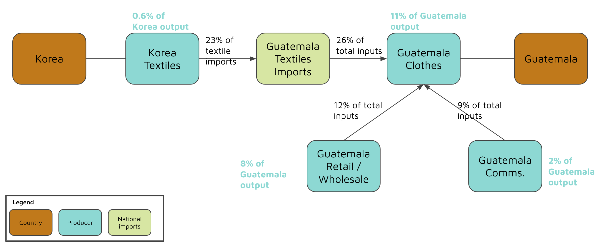
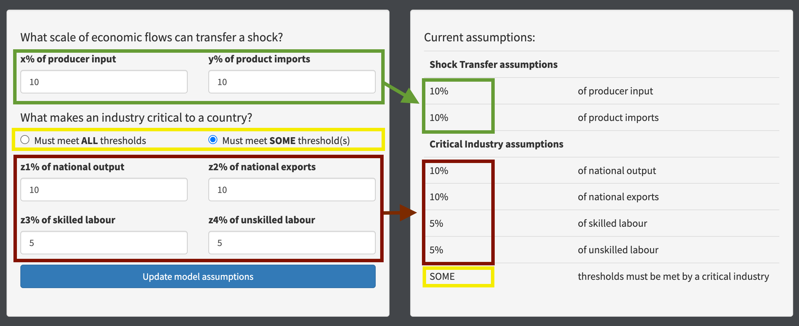
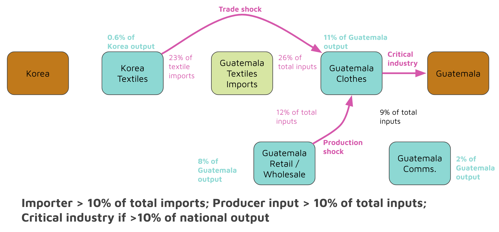
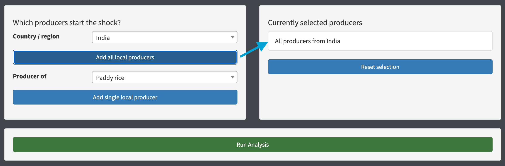
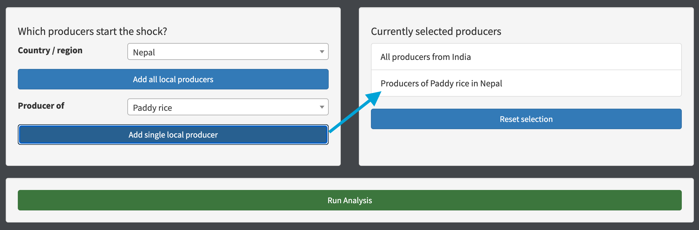
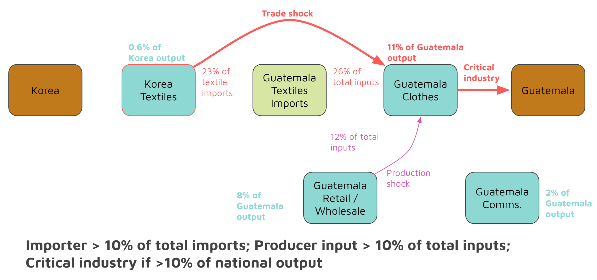
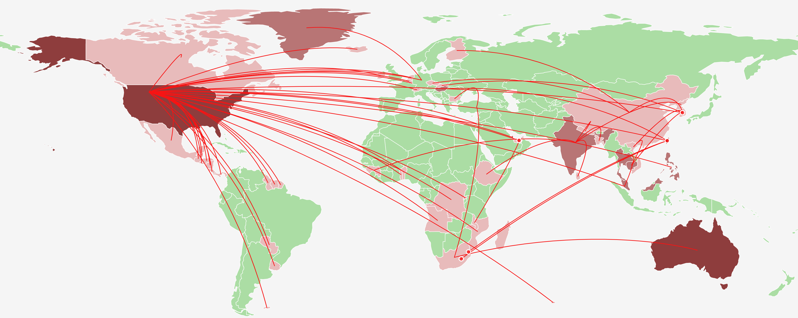
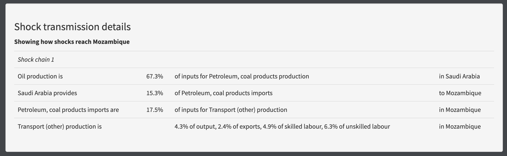
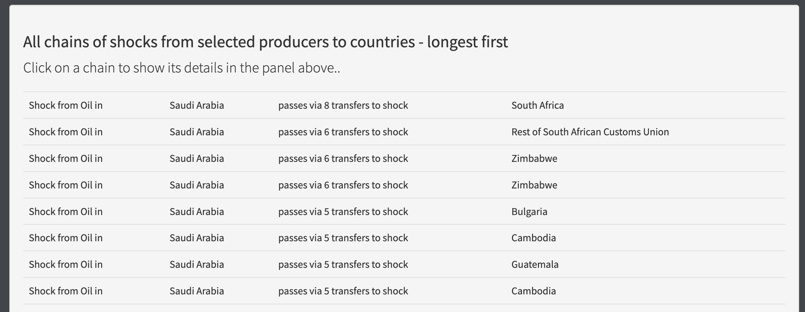

# ShockNet user documentation

## What is ShockNet?

ShockNet is an adjustable economic model for studying how shocks (currently only supply shocks) pass from country to country under certain assumptions. There are a few pieces of terminology to understand first.

- **Producer**: the production of a single sector in a specific country, e.g. the Oil sector of Mexico
- **Importer**: represents the entire import of a specific product into a country, e.g. all of the Textiles imports to Guatemala - in practice you don't see these very much in the app
- **Shock**: currently a supply shock
- **Shock chain**: a chain of shocks that ripple from producers to other producers and possibly onto the countries where the producers are located
- **Critical industry** (of a country): a producer of a country which is significant to the country it is located in, such that if the critical industry experiences a shock, we will consider that it causes a crisis / shock to the country, e.g. if an industry that exports 20% of the country's total exports experiences a shock we might assume that the country will have a crisis

## The basics of ShockNet's model

ShockNet contains data distilled from the [Global Trade Analysis Project (GTAP) data-base](https://www.gtap.agecon.purdue.edu/). It bakes this data into a graph model using [TigerGraph Graph DB](https://www.tigergraph.com/) that captures the links between producers, importers, and countries, and the relative importance (% of total) of the various flows and activities. The diagram shows an example of these links.



The fundamental assumption is that if some supply shock comes from a producer, then all other production / imports that take that producer's output might be affected - depending on how important the link is. It allows the user to set thresholds on the scale of flows that will cause a shock to pass from one producer to another, e.g. "assume that if more than 10% of a producer's inputs by value are experiencing a supply shock, then the producer will pass the shock on." [I describe more about the adjustable assumptions later](#setting-model-assumptions)

### Concept: shock transfers

Fundamental to ShockNet is the passing of shocks from one producer to another, and on to create chains of shocks. The question can be reasonably asked, what does this correspond to in the real world?

The model is concerned with supply shocks, assuming this means less of a producer's output will be available (e.g. the harvest of rice fails in some country). It can be fairly assumed that if the total supply (amount available) of a product significantly decreases, then either the price will significantly increase and/or the users of the product will have to reduce their usage of it. If they are not able to substitute some other product (e.g. I can make my food product from wheat rather than rice) then the only way they can reduce usage is to reduce their own production, which then passes along reduced supply to those who use their output.

Since ShockNet is currently a simple model, with no current notion of demand, substitutability, or elasticities, it assumes that a producer receiving a shock (a producer of one of their inputs has produced less, so less is available), they will either lower their production, or pay more for the input and charge more for the output they produce. If they reduce production, then prices will tend to rise for their product, so the outcome is the same and they effectively pass the same type of shock along to those who depend on their outputs under this assumption - the prices of the output become higher.

## Controls common to all analyses

ShockNet allows the user to update the assumptions over how significant a flow needs to be for it to transfer a shock. The intended interaction style is:
- Set some assumptions
- Perform many analyses on the shock transfers will occur on the current assumptions
- Potentially adjust assumptions and go around the loop again

### Setting model assumptions

If ShockNet is completely new to you, I recommend starting from the section [What is Shocknet?](#what-is-shocknet) before returning here.

When you adjust assumptions, you use the controls on the left of the page, and click the "Update model assumptions" button. After a short wait, you should see the new values reflected on the right hand side of the page, as below.



The settings you can adjust are described below.

#### What each threshold / control means

Thresholds can be set that affect how shocks are assumed to pass between producers:
- **x% of producer input**: if producer1 uses an input from producer2 (or importer2), then assume that a shock can transfer from producer1 to producer2 if the input is at least x% of the total inputs used by producer2
- **y% of product imports**: if producer1 exports to importer2 (remembering that an importer represents all imports of a single product into a single country), then assume that a shock can transfer from producer1 to importer2 if the producer1 exports at least y% of the total received by importer2, i.e. the exporting country makes up at least y% of the total imports of the product into the importing country
- In practice, we combine the thresholds for producers that use imported products, so we say that a shock passes from producer1 making product1 in country1 to producer2 in country2, if producer1 exports at least y% of the imports of product1 into country2, and imports of product1 make up at least x% of the total inputs used by producer2

Thresholds can also be set that affect how shocks are assumed to pass from producers to the countries where they are located (i.e. what makes a producer a **Critical industry** of their country):
- **z1% of national output**: if producer1 in country1 produces at least z1% of country1's total output by value, assume they are a critical industry of country1, and a shock can pass from producer1 to country1
- **z2% of national exports**: if producer1 in country1 exports at least z2% of country1's total exports by value, assume they are a critical industry of country1, and a shock can pass from producer1 to country1
- **z3% of skilled labour**: if producer1 in country1 uses at least z3% of country1's total use of skilled labour by value, assume they are a critical industry of country1, and a shock can pass from producer1 to country1
- **z4% of unskilled labour**: if producer1 in country1 uses at least z4% of country1's total use of unskilled labour by value, assume they are a critical industry of country1, and a shock can pass from producer1 to country1
- **Must meet ALL thresholds / Must meet SOME thresholds**: whether the thresholds are combined using "AND" or "OR", i.e. the producer must meet all four thresholds, or the producer must meet one or more thresholds.

**NOTE**: for horizon scanning mode, the focus is on producers that you have a desire to protect, and shocks to countries are not a part of the analysis, so the critical industry settings are only used when you choose to investigate how to protect "All critical industries of countryX."

#### The effect of the assumptions - a shock transfer graph
In terms of the graph, clicking the "Update model assumptions" button causes some new categories of link to be written, and then all futher analyses only happen using these new categories of links. So for example, if the starting graph looks like:


And you set assumptions that say a shock transfers if an input that is at least 10% of a producer's total input is shocked or an import that is at least 10% of total imports of the product into the country are shocked (i.e. x% = 10, y% = 10). And you set assumptions that a critical industry is one that produces at least 10% of national output (i.e. z1% = 10, z2% = 0, z3% = 0, z4% = 0, must meet ALL thresholds). Then the new graph (showing only the new categories of links) will look like:



All further analysis will happen based on this new shock transfer graph, until the assumptions are changed again (which causes all of these links to be deleted and replaced with the links that meet the new assumptions). The meaning of a link in this new graph is "a shock can potentially pass between these entities" or equivalently "if a shock occurs to the source of the link, it will pass to the destination of the link."

#### Difference with Horizons scanning page

## Effects analysis mode

If ShockNet is completely new to you, I recommend starting from the section [What is Shocknet?](#what-is-shocknet) before returning here.

Once [assumptions are set](#setting-model-assumptions) the effects analysis mode allows us to ask "under these assumptions, if a crisis begins with some set of supply shocks, what countries will experience a crisis" and to drill into how the model predicts various chains of shocks.

### Selecting producers experiencing a shock

You select the producers whose supply shock begin the crisis you want to model. The controls are laid out with the inputs to the left, and the currently selected list of producers to the right. You can add either all of the producers from a single country (e.g. simulating a widespread embargo of that country):



Or, more likely a single producer of a country (e.g. all of the rice output from Nepal is affected):



You can reset the current selection and start again if you make a mistake with your selections.

**NOTE**: there are some pseudo-producers available to select as the starting point of the crisis, that represent non-producable inputs of Land, Capital, Natural Resources, Skilled and Unskilled Labour. Although nobody strictly produces these, the purpose of leaving them in is to simulate hypotheticals like "if there were some economic condition that massively affected the availability of investment Capital in China, what might happen" or "if India institutes a policy that makes land much harder to acquire, what might happen."

Once you have setup the producers that you would like to simulate a supply shock for, press "Run analysis" to show how the model predicts the crisis will spread. At a conceptual level, this is looking at the links from your producers to countries, e.g. in the running example if "Textiles production of Korea" is selected then the analysis finds the path shown:



### Analysis output

The analysis plots the affected countries onto a world-map as a visual reference. They are colour-coded by the amount of output that critical industries of the country receiving a shock account for. If you hover over any country, link or bubble, you will see details about it. 



All countries that will a shock to some critical industry of theirs under these settings will be coloured a shade of pink/red. All countries not receiving a shock to their critical industries will be left green. If shocks transfer within one of these countries, without affecting a critical industry, a red bubble is drawn on the country.

If you click on any country, you will see details on the chain of shocks that the model predicts in the window below.



There is also a panel showing all of the shock chains that the model predicted, ordered by the length of the chain from longest to shortest.



## Horizon scanning mode

If ShockNet is completely new to you, I recommend starting from the section [What is Shocknet?](#what-is-shocknet) before returning here.

### Selecting producers to protect from a shock

### What the analysis means

## Group analysis mode

If ShockNet is completely new to you, I recommend starting from the section [What is Shocknet?](#what-is-shocknet) before returning here.

### What the analysis means


### Markdown

Markdown is a lightweight and easy-to-use syntax for styling your writing. It includes conventions for

```markdown
Syntax highlighted code block

# Header 1
## Header 2
### Header 3

- Bulleted
- List

1. Numbered
2. List

**Bold** and _Italic_ and `Code` text

[Link](url) and 
```

For more details see [Basic writing and formatting syntax](https://docs.github.com/en/github/writing-on-github/getting-started-with-writing-and-formatting-on-github/basic-writing-and-formatting-syntax).

### Jekyll Themes

Your Pages site will use the layout and styles from the Jekyll theme you have selected in your [repository settings](https://github.com/byronrthomas/ShockNetDocs/settings/pages). The name of this theme is saved in the Jekyll `_config.yml` configuration file.

### Support or Contact

Having trouble with Pages? Check out our [documentation](https://docs.github.com/categories/github-pages-basics/) or [contact support](https://support.github.com/contact) and we’ll help you sort it out.
